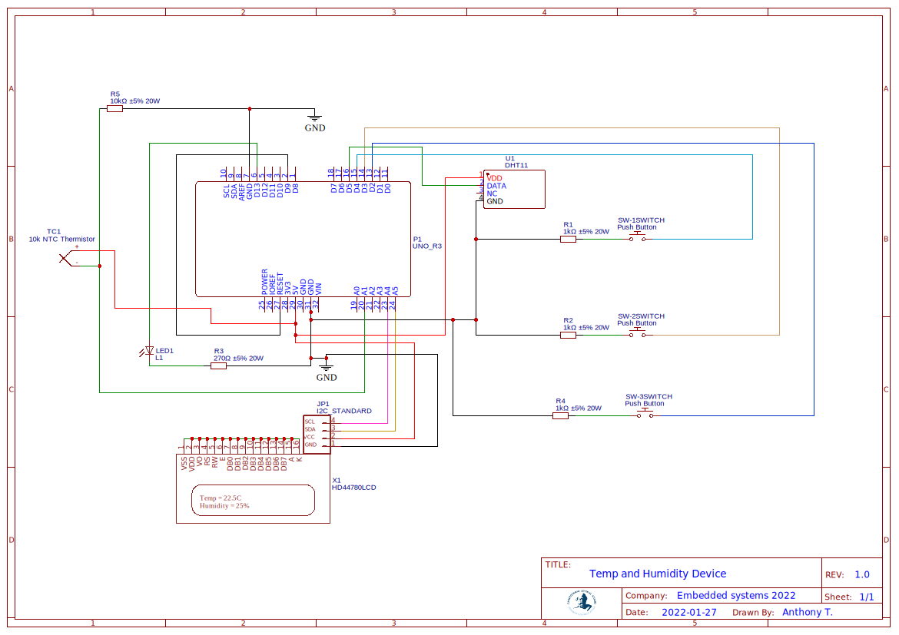
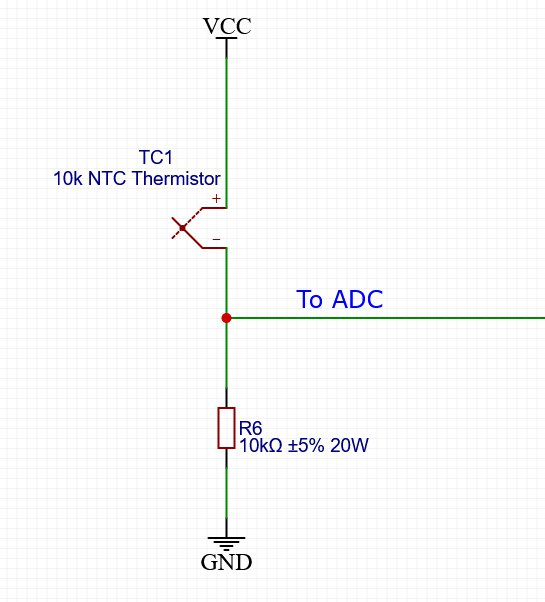
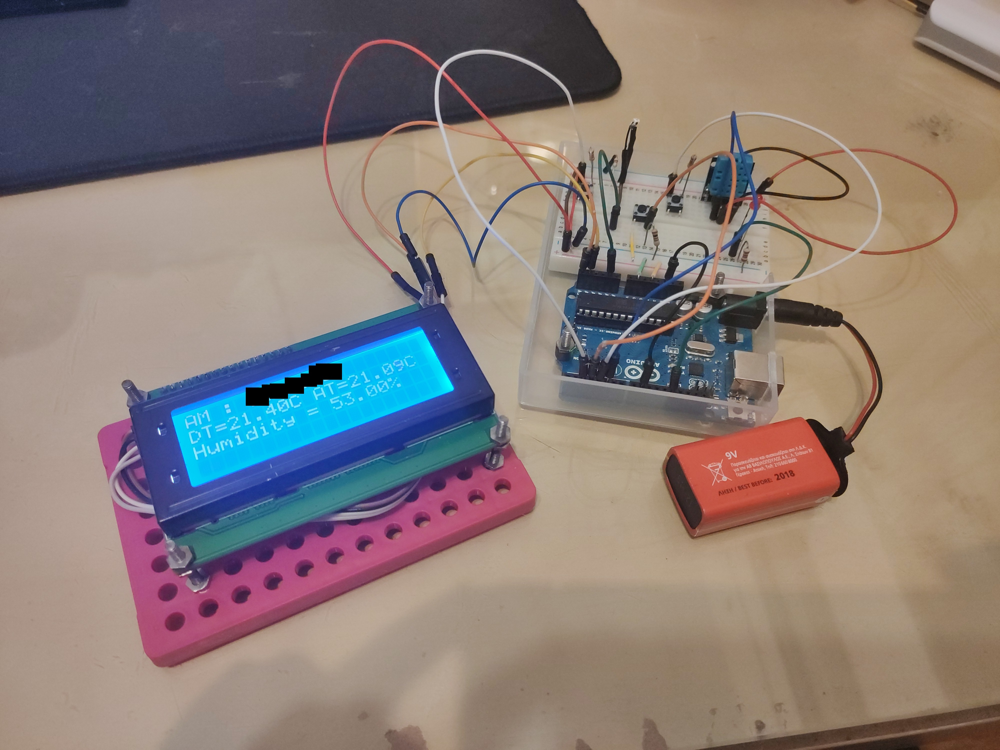
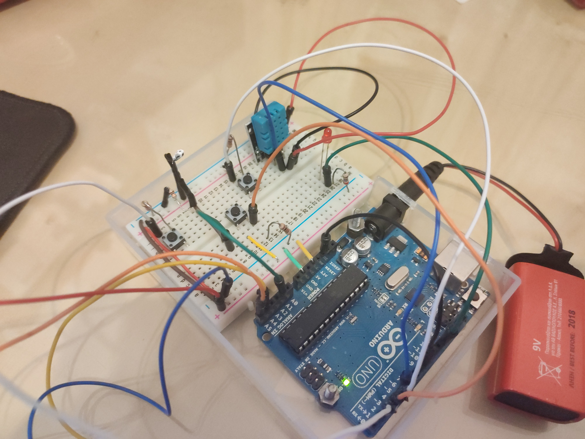

# Table of contents
[Project Description](https://github.com/AnthonyThomahawk/Temp-And-Humidity-ES#project-description) 
[Implementation (hardware and software used)](https://github.com/AnthonyThomahawk/Temp-And-Humidity-ES#implementation-hardware-and-software-used) 
[Connection Schematic](https://github.com/AnthonyThomahawk/Temp-And-Humidity-ES#connection-schematic) 
[Bill of materials (BOM)](https://github.com/AnthonyThomahawk/Temp-And-Humidity-ES#bill-of-materials-bom) 
[Price estimate for 100 and 1500 pieces](https://github.com/AnthonyThomahawk/Temp-And-Humidity-ES#price-estimate-for-100-and-1500-pieces) 
[Safe operating temperature](https://github.com/AnthonyThomahawk/Temp-And-Humidity-ES#safe-operating-temperature) 
[Theoretical Battery life (with a 750 mAh battery)](https://github.com/AnthonyThomahawk/Temp-And-Humidity-ES#theoretical-battery-life-with-a-750-mah-battery) 
[Actual battery life (with a 750 mAh battery)](https://github.com/AnthonyThomahawk/Temp-And-Humidity-ES#actual-battery-life-with-a-750-mah-battery) 
[Improvised analog temperature sensor](https://github.com/AnthonyThomahawk/Temp-And-Humidity-ES#improvised-analog-temperature-sensor) 
[Accuracy of the thermistor](https://github.com/AnthonyThomahawk/Temp-And-Humidity-ES#accuracy-of-the-thermistor) 
[Pictures](https://github.com/AnthonyThomahawk/Temp-And-Humidity-ES#pictures) 
# Project Description

The project goal is to create an Embedded system that
reports temperature (in °C) and humidity (in %) values on an LCD
screen.

+ The system will also feature three Buttons, S1 that when
held down shows the maximum temperature recorded during the
session, S2 which performs a hardware reset on the system and
S3 that toggles the backlight on the LCD display.
+ It will also have an LED (L1) which blinks periodically every 1 second to indicate
the active state of the system.
+ In addition, the system features a
self-made analog temperature sensor made with a thermistor
from a laptop battery pack.

# Implementation (hardware and software used)
The project has been implemented on the Arduino UNO platform,
using Arduino IDE. 
The modules/components used to achieve the shown results are : 

+ Improvised analog temperature sensor
+ DHT11 temperature and humidity sensor
+ LCD 20x4, HD44780 with blue backlight and built-in I2C
+ 3x pushbutton switches
+ 1x red LED
+ 4x resistors (3 for the buttons and 1 for LED)
+ 9V battery

For the above components, the following libraries were used: 

+ [DHT sensor library for DHT11](https://www.arduino.cc/reference/en/libraries/dht-sensor-library/)

+ [LiquidCrystal I2C library (for HD44780 LCD 20x4)](https://www.arduino.cc/reference/en/libraries/liquidcrystal-i2c/)

In order to compile and upload the project to an Arduino UNO
board you must install [Arduino IDE](https://www.arduino.cc/en/software	"Arduino IDE") and the above libraries.

# Connection Schematic

# Bill of materials (BOM)

Points below are hyperlinks leading to the store i bought all
modules and components.

+ [Arduino UNO - 22 €](https://www.devobox.com/el/official-boards/1-arduino-uno-rev3.html?search_query=arduino+uno&amp;results=137)

+ [DHT11 sensor - 2.2 €](https://www.devobox.com/el/enviromental/477-dht11-module-digital-humidity-temperature-sensor.html?search_query=dht11&amp;results=2)

+ [LCD 20x4, HD44780 - 9.2 €](https://www.devobox.com/el/lcd/672-lcd-20x4-with-iici2ctwi-spi-blue-backlight-for-arduino-gr.html?search_query=lcd+blue&amp;results=139)

+ [Pushbutton switches x2 - 0.2 €](https://www.devobox.com/el/push-buttons/1113-pushbutton-switch-6x6x4mm-gr.html?search_query=push+button&amp;results=103)

+ [Red LED - 0.1 €](https://www.devobox.com/el/led/69-led-red-5mm.html?search_query=Red+LED&amp;results=364)

+ [Resistors x4 - 0.04 €](https://electrobot.gr/index.php?route=product/product&amp;product_id=183&amp;skr_prm=WyJiODNmZDA3Mi1lYjBlLTQ4ZTEtOWZmYi03NzlhNmE2YzgyOTUiLDE2NDMyNjYxMTA2NDgseyJhcHBfdHlwZSI6IndlYiIsImNwIjoiYiIsInRhZ3MiOiIifV)

+ [9V battery - 1.23 €](https://www.videophot.gr/index.php?route=product/product&amp;product_id=4545&amp;skr_prm=WyJiODNmZDA3Mi1lYjBlLTQ4ZTEtOWZmYi03NzlhNmE2YzgyOTUiLDE2NDMyNjYyMTkxMDgseyJhcHBfdHlwZSI6IndlYiIsImNwIjoiYiIsInRhZ3MiOiIifV)

# Price estimate for 100 and 1500 pieces

Prototype price = 34.96 € ~= 35 € 
Arduino UNO costs 5.5 € for 100 pieces, and 4 € for 1000+ pieces
on Alibaba, also LCD HD44780 costs 3.5€ for 100 pieces and 2€
for 1000+ pieces.  The other components were already very cheap
so I just calculated the final price relative to the sum of
arduino+LCD monitor. 
Arduino UNO + LCD prototype price = 31.2 ~= 31 € 
Arduino UNO + LCD bulk price 100 pieces = 9 € 
Arduino UNO + LCD bulk price 1000+ pieces = 6 € 
For 100 pieces, we have 31/9 = 3.4 times less cost 
For 1500 pieces, we have 31/6 = 5.1 times less cost 
Price of 1 in 100 pieces = 10.2 € (35*9/31) 
Price of 1 in 1000+ pieces = 6.8 € (35*6/31) 
Estimate cost for production of 100 units : 
**10.2 * 100 = 102 € Bulk price** 
Estimate cost for production of 1500 units : 
**6.8 * 1500 = 10200 € Bulk price** 
*Note : The improvised analog sensor was not included in the*
*BOM but the cost is minimal anyway.* 

# Safe operating temperature

The safe operating temperature for the Arduino UNO (and the rest
of the system) is -40°C to 85°C with recommended temperature
range of -25°C to +70°C. However, the actual meaningful
temperature range for this system is 0 to +50°C because the
DHT11 sensor can only measure temperature correctly in that
range.

# Theoretical Battery life (with a 750 mAh battery)

If we use a 750 mAh battery to power the system, we can expect
a battery life of about 8 hours and 42 minutes.
The above was calculated with the formula : 

 
The total system power consumption is estimated at around :
32 mA(LED screen with backlight) + 48 mA(Arduino UNO) + 0.3
mA(DHT11) + (12mA/2) (Red LED) = **86.3 mA**

So we get : 

 
# Actual battery life (with a 750 mAh battery)

Using a multimeter I measured the actual power consumption of
the system by connecting the multimeter in series with the 9V
battery and found it to be 69.9 mA ~= 70 mA on average: 

 
# Improvised analog temperature sensor

I managed to make a “home made” analog temperature sensor
from a thermistor extracted from a laptop battery pack (from the
same pack that i used the 18650 battery for my [IoT project](https://github.com/AnthonyThomahawk/GPSTracker-IoT)), they
are used to detect overheating during charging. I measured the thermistor resistance and it falls with increasing
temperature so it is a negative temperature coefficient (NTC)
thermistor.
 It seems like a 10kΩ (at 25C) NTC thermistor like the TDK 810-
NTCGP3JH103HCJBA. When I measured it with a multimeter at
22C room temperature, I got 12kΩ resistance, so am guessing it
is 10kΩ at 25C.
 Arduino Uno ADC has 10 bit resolution which means 2^10 = 1024
steps so adcMax = 1023.
 Mapping 0V to 5V in 0 to 1023 steps gives us 5/1024 = 4.9mV
ADC resolution.
 We will use a voltage divider with a matched resistor (in our case
10kΩ resistor for 10kΩ thermistor) and measure the voltage drop
on the thermistor.

Wiring diagram :

After using the Arduino built in function analogRead() to read and
convert the voltage to 0-1023 steps, I used the code and formula
found [here](https://www.jameco.com/z/NTC-103-R-Thermistor-NTC-K-10-10k-Ohm_207037.html) which is : 

 
where T0 is room temperature in Kelvin, Beta is the beta constant
also in kelvin, adcMax is the max steps of Arduino UNO ADC
which are 1023 and adcVal is the average of 5 values read from
the thermistor with analogRead().

I used the value 3988 for Beta from the [data sheet](https://product.tdk.com/system/files/dam/doc/product/sensor/ntc/ntc_assy/catalog/sensor_ntc-thermistor_assembly_en.pdf?ref_disty=mouser) of NTCGP3JH103HCJBA which looked similar to the thermistor I had.

# Accuracy of the thermistor

I created an excel table from measurements of the ADC Input
readings of the thermistor, the temperature in kelvin and celcius
calculated using the above formula, and the temperature of
DHT11 digital sensor for comparison.

| β value | 10bit adcVal | 1/T         | T in K | T in °C | DHT11 °C | Difference |
| ------- | ------------ | ----------- | ------ | ------- | -------- | ---------- |
| 3988    | 533          | 0.003346204 | 298.85 | 25.70   | 25.30    | 0.40       |
| 3988    | 495          | 0.003381686 | 295.71 | 22.56   | 22.20    | 0.36       |
| 3988    | 476          | 0.003399558 | 294.16 | 21.01   | 21.00    | 0.01       |
| 3988    | 468          | 0.003407125 | 293.50 | 20.35   | 20.60    | -0.25      |
| 3988    | 460          | 0.003414722 | 292.85 | 19.70   | 19.80    | -0.10      |
| 3988    | 440          | 0.003433869 | 291.22 | 18.07   | 17.40    | 0.67       |

The original formula was : 

 
but i changed the
adcVal -1 to adcVal - 0.95 for results much closer to DHT11.
Same measurements done with the original formula :

| β value | 10bit adcVal | 1/T         | T in K | T in °C | DHT11 °C | Difference |
| ------- | ------------ | ----------- | ------ | ------- | -------- | ---------- |
| 3988    | 533          | 0.003332924 | 300.04 | 26.89   | 25.30    | 1.59       |
| 3988    | 495          | 0.0033702   | 296.72 | 23.57   | 22.20    | 1.37       |
| 3988    | 476          | 0.003388879 | 295.08 | 21.93   | 21.00    | 0.93       |
| 3988    | 468          | 0.00339677  | 294.40 | 21.25   | 20.60    | 0.65       |
| 3988    | 460          | 0.003404682 | 293.71 | 20.56   | 19.80    | 0.76       |
| 3988    | 440          | 0.003424581 | 292.01 | 18.86   | 17.40    | 1.46       |
 
Average difference from DHT11 with the original formula : 1.13 
Average difference from DHT11 with the modified formula : 0.30

# Pictures

 

